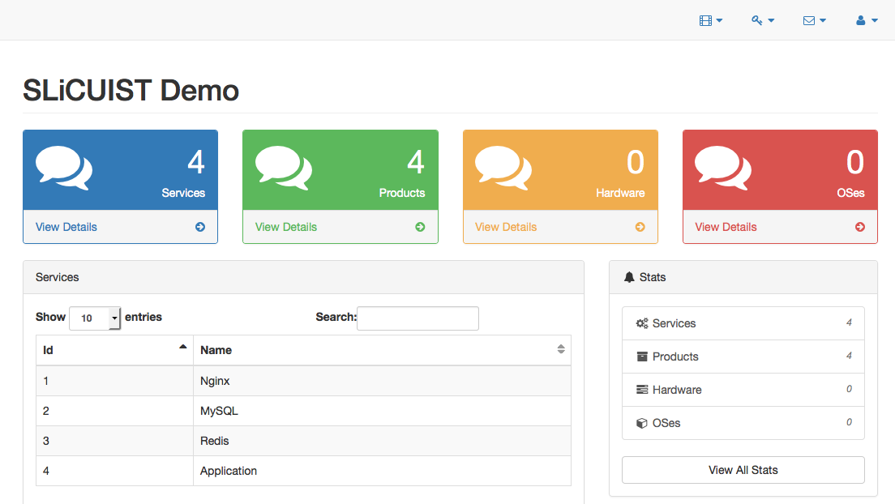

# SLiCUIST

## Sub-Linear Complexity UI System Template

SLiCUIST, pronounced as "sleekest", is an example of my methodology for doing dynamic web client-server rendering in a way that takes minimal setup, and can scale massively, while costing sub-linear amounts of effort to set up new UI and content.

I have often read complaints about how Web Development is awful compared to traditional rich GUI libraries, which I have found to be exactly the opposite for myself.  I have worked with traditional GUI libraries for over 20 years and have found them very difficult to get initially set up, and even more difficult to change once they are set up, and very limited in terms of how much depth and breadth can be added to them due to their bulky and heavy nature.  

Frequently early decisions limit the amount of UI that can actually be created later, as the data structures are simply not available or cannot be connected with a reasonable amount of work to existing UI.

In contrast, the methodology I have been using through browsers (HTML/JS on the client, with the majority of dynamic generation on the server) has been scaling excellently for me for the past 10 years (now 2015), and I would say is "infinitely" scalable with a "sub-linear" amount of effort and complexity, which means that as you add more UI to an application it takes less time than it did the first time for additional components of a similar nature.

The goal of efficiency should be to create logarithmic functions, but this takes many efficiencies to create, and may ultimately be impossible and require an "M*log(N)" algorithm at best.  Still, sub-linear is a great efficiency over the N^2 and above type complexities I have found in working with traditional GUI libraries and frameworks.

## Example Website



I am using the base Bootstrap web template released under the Apache 2.0 license at: http://startbootstrap.com/template-overviews/sb-admin-2/

You can find the full files under the <a href="web_template/">web_template/</a> path for your convenience, but you can also pull this down from the above link or through Bower also described in the above link.  Obviously the Slocust technique works with any type of HTML-style client-server request workflow, so this is just a convenient example as it has many UI elements put together already for us.

The active web files that the Python dynamic web server is using are under the <a href="templates/">templates/</a> path, which are stripped down versions of the <a href="web_template/">web_template/</a> content.  For my development methods I like to keep example files close by so I can copy and paste things out of them to test new UI, so I am leaving these slightly duplicated in this format so I can continue to extend this demonstration in my usual method, and you can use this method as well.

The <a href="templates/">templates/</a> path will also server as our Document Root for the static files of the server, although the program will be launched from the project-root directory ("./"), so both the <a href="scripts/">scripts/</a> and <a href="templates/">templates/</a> directory are reachable as children.  The <a href="database/">database/</a> will contain an example SQLite 3 database called "opsdb.db", which I will use to populate dynamic data in the Python Flask server.  There are backups of this database and an HTML representation of the data in <a href="database/sql_backups/">database/sql_backups/</a> which will show the progression of this schema and data through SQL dumps, for those interested in that.

I have written the example Python dynamic web server portion of this using Flask, which is a "micro-framework", and thus has very short code paths.  The initial version is a very simple and naive RPC implementation.  I may extend this to demonstrate REST and other styles of RPC in the future, but those are not necessary to demonstrate this technique as they are just syntax sugar and conventions for a different type of scalability (mostly, name spaces and consistent access methods).

## What do you mean by "Sub-Linear Complexity"?

For me, the biggest problem to solve is always programmer time.  The length of time it takes to develop software to solve a problem is too damn long!

When other optimizations are required, such as execution speed, memory or storage size, these are usually able to be solved by inspecting the specific problem's parameters, and making adjustments that account for exactly how that work can be minimally done with the specific infrastructure being used to run the software.

What about all the other cases?

For all cases where the primary problem remains how long it takes to develop software, and by how many people.  This is especially true for the "maintenance" of software, which is actually extending the software to do things it was not previously doing before.

This "maintainence" is actually much more difficult than the word makes it sound, as it sounds like maybe some wheels might need oiling, or it might have to be re-painted.  Instead, what "maintenance" means (as we all know from experience) is that we want to re-design the software, as minimally as possible, to allow it to continue to do exactly what it is already doing, while making only specific feature changes, that will work in the desired fashion.  This is significantly more difficult than performing these same feature requests on a new piece of software, since there are no previousy restrictions, where an existing piece of software already does what it does perfectly, and any changes are likely to break that, and may not be easily made with the previous decisions which didn't take the new decisions into account.

So...  "Sub-Linear Complexity" is referring to <b>this</b> kind of complexity, the kind that has to do with making more and more features, and making more and more changes inside those features.  It is the "Complexity of More", or the "Complexity of Scaling".

Since creating more things is always a scaling issue, then the question is how can this scaling be done efficiently?

This Sub-Linear Complexity system was developed to deal with this problem directly, by turning things that were previously done by hand as one-offs (source files, web page files, config files), and creating a database based system for containing all of that data, so it works systematically, and not as one-offs.

This allows for more efficient scalability, as the data schema defines how growth will occur, so there are less differences which cause scalability bottlenecks.

## Installation

You will need Python 2 and the library Flask.  Install this with Pip:

```
pip install flask
```

Then pull down this repo locally:

```
git clone https://github.com/ghowland/slocust.git
```

Then run the server from the repo directory:

```
./start.sh
```

And direct your browser to this page:

```
http://127.0.0.1:5000/
```

# SLiCUIST Layers

I have split the SLiCUIST models into 4 layers, so that each layer's design can be considered independently, as they could be replaced at that layer with a different mechanic for doing the work than the one I suggest here, while the other layers are independent of that decision.

## Client/Server Communication - Layer 1

Layer 1 is the basic communication model of SLiCUIST, which is that the browser is a "Drop Target" for named content sections (generally DIV elements with specified IDs).  These targets can be replaced dynamically as needed after the initial rendering, using the same code that rendered the initial page.

Additionally, dialog and other layered content can be added at any time to the page, using the initial page rendering's element IDs, or under dynamic names (uniquely hashed) for dynamic and layered content.

### Layer 1.1: Naming Convention

Naming convention is used between the Server which renders the initial data, and the Client which holds it.  The names must match so that the Server can re-render the Client's components individually if necessary.

### Layer 1.2: Template Organization

Templating organization is used to ensure composability of the elements, so that they can be mixed and matched together.

Import elements to organization:

- Base Pages: These are the final templates before a Page or RPC request is rendered.

- Widget Templates: These are snippets of HTML and JavaScript needed to render widgets or components in a page.  They are templated to complete them, and can be templated in a hierarchy, with widgets including the rendered outputs of other widgets.

- RPC Specifications: Basically, the same as pages but are meant to be used after a Page has been rendered to updated things dynamically.

### Layer 1.3: Dynamic Element Update

Dynamic Element update is done with the same code that populates the initial page.  This is the Client Update portion of the pattern.

The server renders the page in templated pieces, and finally composes those pieces into the final initial-page render.

On request from the client, the page is updated through RPC, which can dynamically update only parts of the page (or the whole page), by replacing their element content completely (by specifying the element ID), and running any JavaScript necessary to activate any of the elements inside the content.

### Dynamic-Everything From a Database - Layer 2

### Layer 2.1: Dynamic Web Site in Database 

When getting HTTP requests, these should be dynamically routed for processing the dynamic content.  There should not be specific files that have to be maintained by hand for mapping what URI is to be processed.  This is not a massively-scalable solution, and is a manual process that can be replaced by keeping the data in a database.

If required for performance reasons, this data can still be templated into a configuration or source code text file, and then used or compiled so that the required performance is still attained, while always using dynamic data to handle the page routing.

Web pages should be separated by web site, which can have any number of domains mapped against them.  This is a normal state of affairs in web development, and the database schema should closely model the existing paradigm, so that all the goals that people current fullfill while working in that paradigm remain available to them while working through database schema, instead of custom one-off files.

### Layer 2.2: RPC is stored Dynamically in the Database

RPC data is stored in the database, and can be called from web pages to dynamically render pages, sections, or performance functions.

This is really the same as a webpage, only how it is used is different.  I'm listing it because it's important that it is not implemented separately from web pages if you are going to leverage the same execution path and rules for both of them.  This allows for better security (1 path to protect), and contrains the engineering problems away from the HTTP handling aspects.

### Layer 2.3: Schema for Databases resides in Master Database

Whether you are using a single database for everything, or have multiple databases, you can keep the schema data inside a master database, so that your code and other data can reference the schema elements directly.

Additional meta-data can also be stored about your schema tables and fields, such as which fields to render in default situations such as listing rows, viewing a table row's fields, editing a table row's fields, and what validation requirements each field has.  This is information that is not stored in a database's internal schema information, so if you store this information yourself you can add in additional information which gives you many more options available at runtime, so you can dynamically generate and validate Create/Read/Update/Delete (CRUD) style applications, and extend them as much as necessary beyond that.

### Layer 2.4: Pages are Dynamically Composed

Pages are generated from rows and columns of data, for given sections of the page.

For example there could be a 3 section page:  Main Panel (main, right), Side Panel (left), and Navigation Panel (top).

In this page all of the rendered areas could have 1 or more Widgets that are specified in the database to be rendered in a given row and column, of a given column size, in one of the page areas (Main/Side/Nav).

This allows many Widgets (components, etc) to be rendered onto a page based on dynamic data inside a database.


## Basic GUI Management - Layer 3

### Layer 3.1: Web Site Database is GUI Driven

Creating new web sites, adding or changing their domain, and 

### Layer 3.2: Dynamic RPC is GUI Driven

Test RPC scripts inside the web site.

### Layer 3.3: Widget Rendering Data is Dynamic and GUI Driven

Addition, editing and removal of widgets that are used to render web pages is

### Layer 3.4: Schema Management in Master Database is GUI Driven

You can add/remove fields in your Schema Management directly through your web GUI system, for faster and more interactive development.  This allows you to change validation requirements in real-time and test them.

You can also re-order fields in lists, rename them (with their formatted labels), specify how they are editted, etc.

## Advanced GUI Management - Layer 4

### Layer 4.1: RPC Scripts and Profile Editing and Management is GUI Driven

### Layer 4.2: Page Dynamic Composition is GUI Driven

Layout of the page's area's grid widgets is driven through a GUI in the website, for faster and more interactive development.

